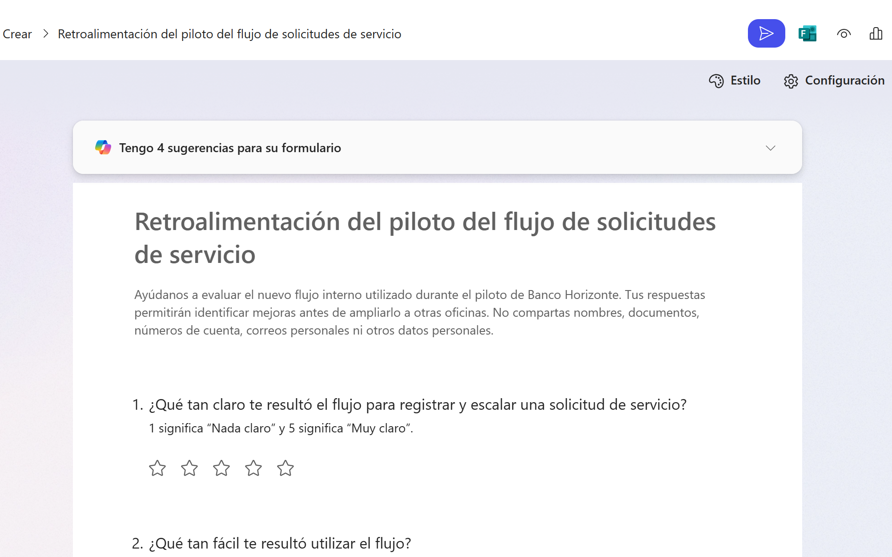
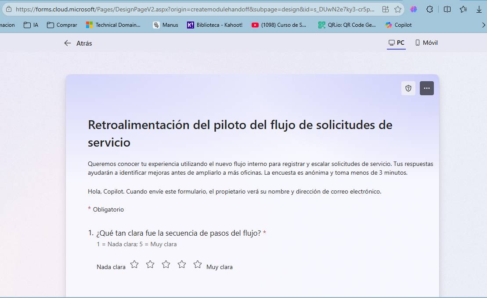

# Módulo 1 - De usar IA a incorporarla en nuestra forma de trabajar

# Práctica guiada: De una necesidad a un formulario listo para utilizar

## Metadata

| Campo | Detalle |
|---|---|
| **Duración** | 6 minutos |
| **Complejidad** | Fácil |
| **Nivel Bloom** | Aplicar |
| **Módulo** | 1 - De usar IA a incorporarla en nuestra forma de trabajar |
| **Tecnología principal** | Microsoft Copilot - Crear un formulario / Microsoft Forms |
| **Modalidad** | Demostración guiada |
| **Escenario** | Banco Horizonte - Retroalimentación de un piloto interno ficticio |

---

## Descripción General

En esta práctica convertirás una necesidad empresarial breve en un formulario utilizable. La información del caso se proporciona directamente en el prompt para evitar archivos innecesarios. Copilot propondrá las preguntas, revisarás la estructura y harás un único refinamiento para dejar el formulario listo para una validación humana antes de distribuirlo.

El objetivo no es aprender a construir un formulario pregunta por pregunta, sino observar cómo una necesidad bien contextualizada puede convertirse en un artefacto de trabajo y cómo la revisión humana mejora el resultado.

---

## Objetivos de Aprendizaje

Al completar esta práctica serás capaz de:

- [ ] Convertir una necesidad de recopilación de información en un formulario generado con Copilot.
- [ ] Comprobar que las preguntas responden al objetivo, audiencia y restricciones indicadas.
- [ ] Refinar el formulario sin reconstruirlo manualmente.

---

## Prerrequisitos

### Conocimientos previos

- No se requiere experiencia previa con Microsoft Forms.
- Debes reconocer los elementos básicos de un prompt: contexto, objetivo y expectativas.

### Acceso requerido

| Recurso | Estado requerido |
|---|---|
| Cuenta profesional o educativa de Microsoft 365 | Iniciada |
| Microsoft Copilot | Disponible con la cuenta de trabajo |
| Opción **Crear > Crear un formulario** | Visible |
| Microsoft Forms | Habilitado por la organización |

> **Antes de iniciar el cronómetro:** confirma que la opción **Crear un formulario** está disponible. Para cuentas profesionales o educativas, Microsoft indica que esta característica requiere una suscripción a Microsoft Copilot.

---

## Entorno del Laboratorio

### Herramientas

- Navegador web actualizado.
- Microsoft Copilot: `https://copilot.cloud.microsoft`
- Microsoft Forms, abierto desde el resultado generado por Copilot.

### Materiales

No se requieren archivos adicionales. Toda la información ficticia necesaria está incluida en el prompt.

---

## Procedimiento Paso a Paso

### Paso 1: Abrir la creación de formularios

**Objetivo:** ingresar directamente a la capacidad que convierte una descripción en un formulario.

**Instrucciones:**

1. Abre `https://copilot.cloud.microsoft`.
2. Comprueba que estás usando tu cuenta de trabajo. La experiencia actual distingue la cuenta profesional mediante los indicadores de trabajo de Microsoft Copilot.
3. En el panel izquierdo, selecciona **Crear**.
4. Selecciona **Crear un formulario**.

### Paso 2: Describir la necesidad y generar el formulario

**Objetivo:** proporcionar suficiente contexto para que Copilot diseñe las preguntas sin recurrir a un archivo externo.

**Instrucciones:** copia y pega el siguiente prompt:

```text
Crea un formulario de retroalimentación para un piloto interno de Banco Horizonte, una organización ficticia.

Contexto:
Durante una semana, 25 colaboradores de sucursales utilizaron un nuevo flujo interno para registrar y escalar solicitudes de servicio. Antes de ampliarlo a más oficinas queremos conocer su experiencia.

Objetivo:
Identificar si el flujo es claro, fácil de usar y suficientemente ágil, y conocer qué debe mejorarse antes del despliegue.

Audiencia:
Colaboradores de sucursal que participaron en el piloto.

Expectativas:
- crea exactamente 7 preguntas;
- el formulario debe poder responderse en menos de 3 minutos;
- combina escala de 1 a 5, opción múltiple y una sola pregunta abierta al final;
- evalúa claridad, facilidad de uso, tiempo percibido, incidentes encontrados y oportunidad principal de mejora;
- no solicites nombre, documento, número de cuenta, correo personal ni otros datos personales;
- utiliza español profesional, directo y fácil de comprender.
```

1. Revisa que el prompt aparezca completo.
2. Selecciona **Crear**.
3. Espera a que Copilot genere el borrador.

### Paso 3: Revisar el borrador

**Objetivo:** comprobar que el artefacto generado realmente responde a la necesidad.

**Instrucciones:** revisa el formulario y responde estas preguntas:

1. ¿Tiene siete preguntas o menos?
2. ¿Incluye al menos una escala de 1 a 5?
3. ¿Incluye preguntas de opción múltiple?
4. ¿La última pregunta permite escribir una mejora en texto libre?
5. ¿Evita solicitar datos personales?
6. ¿El orden va de la experiencia general a aspectos específicos y termina con una oportunidad de mejora?



### Paso 4: Refinar una sola vez

**Objetivo:** demostrar que una instrucción de seguimiento puede mejorar el formulario sin reconstruirlo manualmente.

**Instrucciones:** utiliza la opción de continuar o editar con Copilot e introduce:

```text
Revisa el formulario antes de publicarlo. Déjalo en exactamente 7 preguntas, elimina preguntas dobles o redundantes, conserva una sola pregunta abierta al final y confirma que puede responderse en menos de 3 minutos. Mantén las preguntas sobre claridad, facilidad, tiempo percibido e incidentes. No solicites datos personales.
```

Aplica la propuesta si mantiene el objetivo del formulario.

### Paso 5: Revisar la vista previa

**Objetivo:** comprobar cómo verá el formulario una persona antes de distribuirlo.

**Instrucciones:** 

1. Abre el formulario en Microsoft Forms cuando Copilot ofrezca la acción correspondiente.
2. Selecciona **Vista previa**.
3. Recorre las preguntas sin enviar una respuesta real.
4. Comprueba que la lectura es rápida y que no hay preguntas ambiguas o duplicadas.

**Resultado esperado:** el formulario puede recorrerse en menos de tres minutos y está listo para revisión final.



## Validación y Pruebas

- [ ] El formulario se generó a partir de la necesidad descrita en el prompt.
- [ ] Tiene exactamente 7 preguntas después del refinamiento.
- [ ] Combina escala, opción múltiple y pregunta abierta.
- [ ] La pregunta abierta es la última.
- [ ] No solicita información personal o bancaria.
- [ ] Se revisó la vista previa antes de considerar el resultado terminado.

---

## Solución de Problemas

### No aparece **Crear un formulario**

1. Confirma que has iniciado sesión con una cuenta profesional o educativa.
2. Recarga Microsoft Copilot y vuelve a abrir **Crear**.
3. Si la opción sigue sin aparecer, la capacidad puede no estar habilitada para tu cuenta o inquilino. No sustituyas esta demo construyendo el formulario manualmente, porque cambiaría el objetivo de la práctica.

### Copilot crea demasiadas preguntas

Ejecuta el prompt de refinamiento del Paso 4. No inviertas el tiempo de la demo editando cada pregunta de forma individual.

### Aparece una pregunta que solicita información sensible

Elimina o reformula esa pregunta antes de utilizar el formulario. La práctica requiere información ficticia y no necesita datos personales.

---

## Limpieza

Si el formulario fue creado únicamente para la práctica, puedes eliminarlo al finalizar. No envíes el formulario a personas reales.

---

## Resumen

En seis minutos convertiste una necesidad empresarial en un formulario, revisaste el borrador, aplicaste una instrucción de seguimiento y validaste el resultado desde la perspectiva de quien lo responderá. El punto central de la práctica es que Copilot acelera la creación, pero la persona sigue siendo responsable de revisar pertinencia, claridad y tratamiento de la información.

---

## Recursos adicionales

- Microsoft Support - Crear formularios rápidamente con la aplicación Microsoft Copilot: https://support.microsoft.com/es-es/microsoft-365-copilot/create-forms-quickly-with-the-microsoft-365-copilot-app
