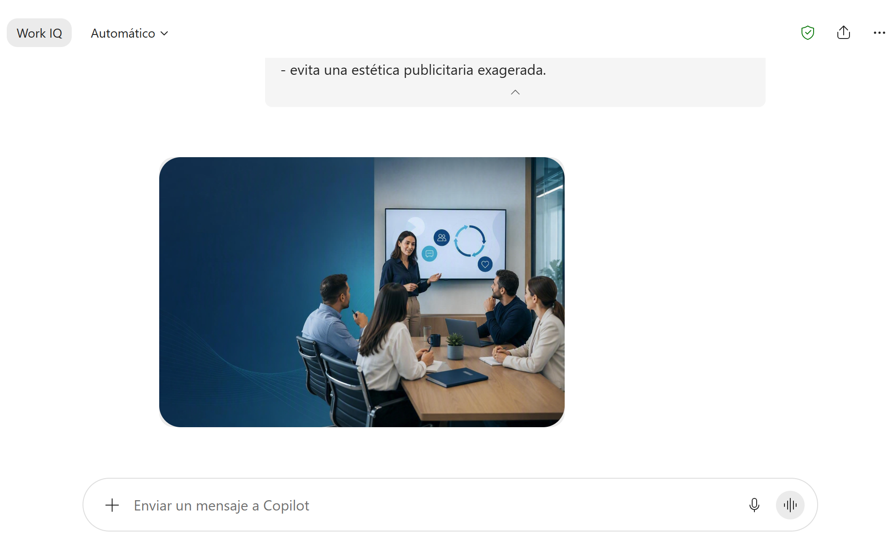
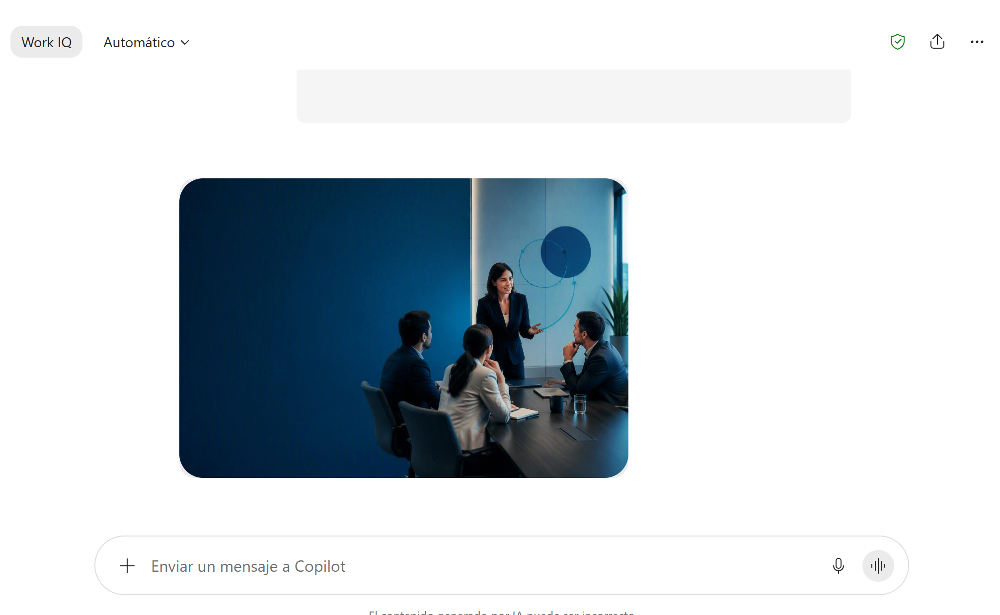

# Módulo 2 - Microsoft 365 Copilot: mucho más que un chat

# Práctica guiada: De una idea a una pieza visual con IA

## Metadata

| Campo | Detalle |
|---|---|
| **Duración** | 5 minutos |
| **Complejidad** | Fácil |
| **Nivel Bloom** | Aplicar |
| **Módulo** | 2 - Microsoft 365 Copilot: mucho más que un chat |
| **Tecnología principal** | Microsoft Copilot Chat - generación de imágenes |
| **Modalidad** | Demostración guiada |
| **Escenario** | Banco Horizonte - Comunicación interna ficticia |

---

## Descripción General

En esta práctica transformarás una necesidad cotidiana de comunicación en una imagen generada con IA. Crearás una primera pieza visual y después modificarás una sola variable mediante una instrucción de seguimiento para observar cómo el contexto y las restricciones del prompt afectan el resultado.

La práctica está deliberadamente limitada a dos iteraciones para ajustarse a los cinco minutos definidos en el seminario.

---

## Objetivos de Aprendizaje

Al completar esta práctica serás capaz de:

- [ ] Formular una solicitud de imagen con propósito, audiencia, composición, estilo y restricciones.
- [ ] Evaluar si la imagen generada cumple el objetivo de comunicación.
- [ ] Refinar una variable visual sin volver a empezar desde cero.

---

## Prerrequisitos

### Conocimientos previos

- Saber enviar una solicitud en Copilot Chat.
- Comprender que los resultados generativos pueden variar entre ejecuciones.

### Acceso requerido

| Recurso | Estado requerido |
|---|---|
| Cuenta profesional o educativa de Microsoft 365 | Iniciada |
| Microsoft Copilot Chat | Disponible |
| Generación de imágenes | Habilitada para la cuenta |

---

## Entorno del Laboratorio

### Herramientas

- Navegador web actualizado.
- Copilot Chat: `https://copilot.cloud.microsoft/chat`

### Materiales

No se requieren archivos adicionales. El escenario y todas las restricciones de diseño están incluidos en el prompt.

---

## Procedimiento Paso a Paso

### Paso 1: Abrir un nuevo chat

**Objetivo:** iniciar la generación sin arrastrar contexto de conversaciones anteriores.

**Instrucciones:**

1. Abre `https://copilot.cloud.microsoft/chat`.
2. Confirma que estás usando la cuenta de trabajo.
3. Selecciona **Nuevo chat**.

### Paso 2: Generar la primera pieza visual

**Objetivo:** convertir una necesidad de comunicación en una descripción visual suficientemente específica.

**Instrucciones:** copia y pega:

```text
Genera una imagen horizontal 16:9 para una comunicación interna de Banco Horizonte, una organización ficticia.

Propósito:
Invitar a los colaboradores a una jornada interna de mejora de la experiencia del cliente.

Audiencia:
Colaboradores de oficinas, sucursales y equipos de operaciones.

Composición:
Una escena corporativa moderna donde varias personas colaboran alrededor de una mesa y revisan ideas en una pantalla. Incluye elementos visuales que sugieran escucha, colaboración y mejora continua. Deja espacio negativo limpio en el lado izquierdo para agregar un título posteriormente.

Estilo:
Profesional, sobrio y contemporáneo. Paleta azul marino y turquesa, iluminación limpia, ambiente confiable y cercano.

Restricciones:
- sin logotipos reales;
- sin nombres de clientes;
- sin números de cuenta ni datos personales;
- sin texto legible dentro de la imagen;
- evita una estética publicitaria exagerada.
```

Envía la solicitud y espera la imagen.



### Paso 3: Evaluar el resultado

**Objetivo:** revisar la imagen antes de pedir cambios.

**Instrucciones:** verifica:

- [ ] ¿La imagen comunica colaboración y mejora?
- [ ] ¿La audiencia parece corporativa?
- [ ] ¿Existe espacio libre en el lado izquierdo?
- [ ] ¿No aparecen datos reales ni logotipos de terceros?
- [ ] ¿El estilo es sobrio y coherente con el uso empresarial?

### Paso 4: Refinar una variable visual

**Objetivo:** observar el efecto de una instrucción de seguimiento.

**Instrucciones:** en la misma conversación envía:

```text
Refina la imagen anterior. Mantén el propósito, el formato 16:9 y la paleta azul/turquesa, pero reduce los elementos secundarios y haz que la escena se vea más ejecutiva y menos publicitaria. Conserva el espacio libre del lado izquierdo y no agregues texto legible.
```

Espera la nueva variante.



### Paso 5: Comparar y guardar

**Instrucciones:**

**Objetivo:** elegir el resultado que mejor cumple el propósito.

1. Compara la primera y la segunda variante.
2. Identifica qué cambió por el refinamiento.
3. Selecciona la versión más adecuada.
4. Usa **Descargar** si la interfaz la ofrece. Si la imagen se abre en la experiencia de creación, utiliza la opción de descarga disponible allí.

---

**Resultado esperado:** La variante seleccionada queda descargada cuando la interfaz ofrece esa opción.

**Verificación:**

- [ ] Se compararon ambas variantes.
- [ ] La selección se basó en adecuación al propósito.

## Validación y Pruebas

- [ ] Se generaron dos variantes del mismo concepto.
- [ ] La segunda variante responde a una instrucción de seguimiento, no a un prompt completamente nuevo.
- [ ] La pieza no contiene información real de clientes o marcas reales.
- [ ] La selección final se realizó por adecuación al propósito, no solo por preferencia estética.

---

## Solución de Problemas

### Copilot responde con texto pero no genera la imagen

1. Reformula el inicio como **"Genera una imagen..."**.
2. Si tu interfaz dispone de **Crear > Crear una imagen**, abre esa experiencia y utiliza la misma descripción.
3. Si la capacidad no está habilitada para tu cuenta, no sustituyas la práctica por una herramienta de terceros.

### La imagen contiene texto no deseado

Envía una instrucción de seguimiento como:

```text
Regenera la imagen sin palabras, letras, números, rótulos ni texto legible. Conserva el resto de la composición.
```

### La imagen incluye demasiados elementos

Pide reducir elementos secundarios y conservar únicamente los componentes relacionados con el mensaje principal.

---

## Limpieza

No se requiere limpieza. Si descargaste variantes que no vas a utilizar, puedes eliminarlas localmente.

---

## Resumen

En cinco minutos convertiste una descripción empresarial en una pieza visual y comprobaste que cambiar una instrucción concreta modifica el resultado. La utilidad del ejercicio está en aprender a controlar propósito, audiencia, composición, estilo y restricciones, y no en generar muchas variantes.

---

## Recursos adicionales

- Microsoft Support - Crear contenido usando Microsoft Copilot Chat: https://support.microsoft.com/es-es/microsoft-365-copilot/create-content-using-microsoft-365-copilot-chat
- Microsoft Support - Crear imágenes generadas por IA con la aplicación Microsoft Copilot: https://support.microsoft.com/es-es/microsoft-365-copilot/create-ai-generated-images-with-the-microsoft-365-copilot-app
