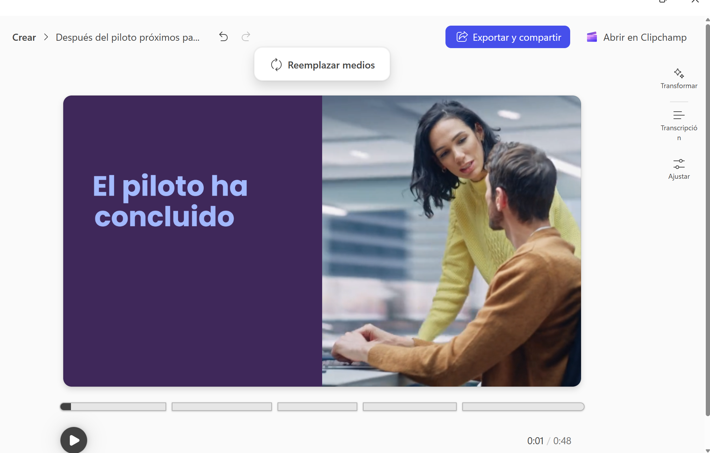
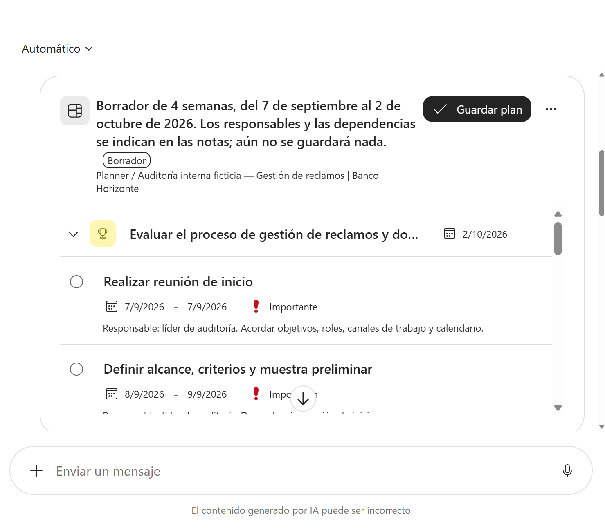
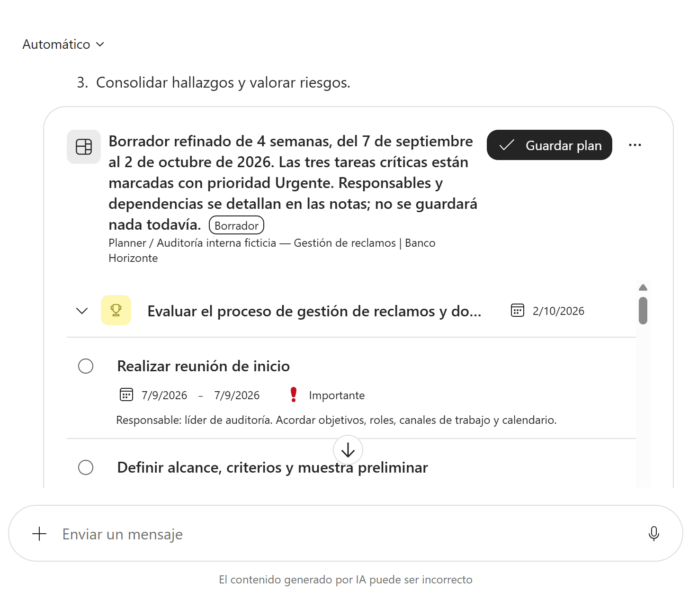
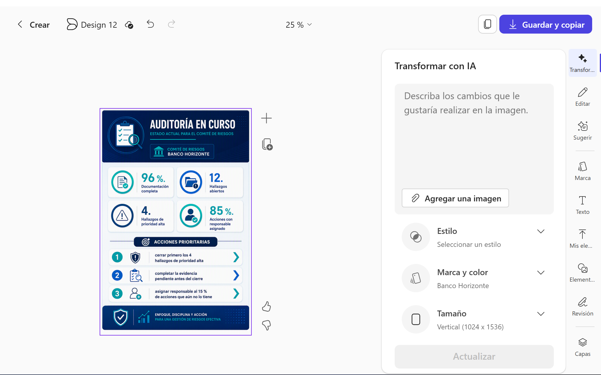
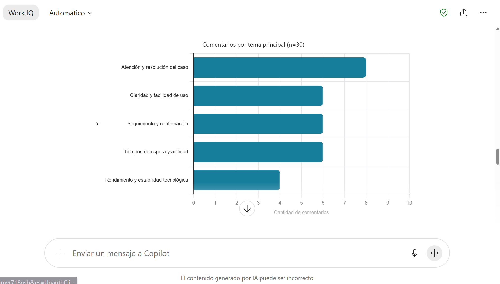

# Módulo 4 - Aplicaciones prácticas de Copilot Chat en el trabajo diario

Este módulo contiene cuatro demostraciones. La duración total es de **24 minutos**, exactamente la definida en el temario.

---

# Práctica guiada 4.1: De una idea a un video con Copilot

## Metadata

| Campo | Detalle |
|---|---|
| **Duración** | 8 minutos |
| **Complejidad** | Fácil |
| **Nivel Bloom** | Aplicar |
| **Módulo** | 4 - Aplicaciones prácticas de Copilot Chat en el trabajo diario |
| **Tecnología principal** | Microsoft Copilot Create + Clipchamp |
| **Modalidad** | Demostración guiada |
| **Escenario** | Banco Horizonte - Comunicación interna ficticia |

## Descripción General

Crearás un video breve de comunicación interna a partir de una descripción textual. Después utilizarás **Editar con IA** para modificar una característica concreta del resultado. Toda la información necesaria está incluida en el prompt; no se requiere un brief adicional.

## Objetivos de Aprendizaje

- [ ] Convertir propósito, audiencia y mensaje en una descripción de video.
- [ ] Revisar si escenas, narración y texto en pantalla corresponden con la solicitud.
- [ ] Refinar el resultado sin entrar en una sesión extensa de edición audiovisual.

## Prerrequisitos

### Conocimientos previos

- Saber redactar y enviar un prompt.

### Acceso requerido

| Recurso | Estado requerido |
|---|---|
| Microsoft Copilot | Disponible con la cuenta de trabajo |
| **Crear > Crear un video** | Visible |
| Microsoft Clipchamp | Habilitado por la organización |

> **Antes de iniciar el cronómetro:** confirma que Clipchamp está habilitado y que **Crear un video** aparece en Microsoft Copilot. Microsoft indica que Clipchamp debe estar habilitado por el administrador para utilizar esta experiencia.

## Entorno del Laboratorio

### Herramientas

- Microsoft Copilot: `https://copilot.cloud.microsoft`
- Microsoft Clipchamp, abierto desde la experiencia de video cuando sea necesario.

### Materiales

No se requieren archivos adicionales. El brief completo está integrado en el prompt.

## Procedimiento Paso a Paso

### Paso 1: Abrir el generador de video

**Objetivo:** abrir la experiencia de creación de video con la cuenta de trabajo y comprobar que Clipchamp está disponible.

**Instrucciones:**

1. Abre Microsoft Copilot con tu cuenta de trabajo.
2. Selecciona **Crear**.
3. Selecciona **Crear un video**.

### Paso 2: Generar el primer borrador

**Objetivo:** convertir el brief incluido en el prompt en un primer borrador de video.

**Instrucciones:**

Copia y pega:

```text
Crea un video interno de 35 a 45 segundos para Banco Horizonte, una organización ficticia.

Propósito:
Comunicar a colaboradores de sucursales y operaciones las acciones posteriores a un piloto de atención digital.

Audiencia:
Equipos de sucursal y operaciones.

Mensaje principal:
El piloto terminó y durante los próximos 30 días se ejecutarán tres acciones:
1. publicar una guía breve de excepciones frecuentes;
2. estandarizar el mensaje de cierre y siguiente paso para el cliente;
3. revisar semanalmente una muestra de casos derivados para detectar oportunidades de mejora.

Tono:
Profesional, calmado, cercano y no publicitario.

Formato:
Horizontal 16:9, aproximadamente cinco escenas, narración breve y texto en pantalla únicamente para las ideas clave.

Restricciones:
No inventes cifras, datos de clientes ni logotipos reales. Cierra invitando a consultar el portal interno para conocer la guía actualizada.
```

Selecciona **Crear**.

### Paso 3: Revisar el borrador

**Objetivo:** comprobar el contenido del video antes de solicitar cualquier refinamiento.

**Instrucciones:**

Reproduce el video y comprueba:

- [ ] duración aproximada de 35 a 45 segundos;
- [ ] presencia de las tres acciones;
- [ ] tono interno y no publicitario;
- [ ] ausencia de datos reales;
- [ ] texto en pantalla legible y breve.



### Paso 4: Refinar con IA

**Objetivo:** modificar una característica concreta del video mediante **Editar con IA** sin rehacerlo desde cero.

**Instrucciones:**

Si el video resulta muy promocional o extenso, utiliza **Editar con IA** y solicita un cambio equivalente a:

```text
Haz el video más sobrio y déjalo cerca de 40 segundos. Conserva las tres acciones, utiliza un ritmo de narración tranquilo y elimina frases promocionales. No agregues cifras nuevas.
```

Selecciona **Crear nuevo borrador** si la interfaz lo solicita.

### Paso 5: Comparar y exportar

**Objetivo:** comparar ambas versiones, seleccionar la más adecuada y conservar el resultado.

**Instrucciones:**

1. Reproduce el nuevo borrador.
2. Compara tono y duración con la versión anterior.
3. Si el resultado es adecuado, selecciona **Exportar y compartir**.
4. No realices una edición completa en Clipchamp durante esta práctica; el objetivo es observar generación y refinamiento.

**Resultado esperado:** La versión seleccionada queda exportada o lista para compartir desde Copilot.

**Verificación:**

- [ ] Se compararon al menos dos borradores.
- [ ] Se seleccionó **Exportar y compartir** cuando el resultado fue adecuado.

## Validación y Pruebas

- [ ] El video se creó a partir de una descripción textual.
- [ ] Se revisaron propósito, audiencia, mensaje y restricciones.
- [ ] Se utilizó **Editar con IA** para un refinamiento concreto.
- [ ] El video final mantiene las tres acciones sin inventar información.

## Solución de Problemas

### No aparece **Crear un video**

Confirma que Clipchamp esté habilitado por la organización. Si la opción no existe, la práctica no puede ejecutarse con el flujo previsto.

### La generación tarda más de lo esperado

Microsoft indica que normalmente la creación tarda menos de un minuto, pero el tiempo real puede variar. Espera a que termine la generación y evita iniciar varias solicitudes en paralelo.

## Limpieza

Si el video se creó únicamente para la práctica, puedes eliminarlo de la biblioteca al terminar.

## Resumen

Convertiste un brief escrito directamente en el prompt en un video, revisaste el resultado y modificaste una variable con IA. El objetivo fue demostrar transformación de contenido, no edición audiovisual avanzada.

## Recursos adicionales

- Microsoft Support - Crear un video con la aplicación Microsoft Copilot: https://support.microsoft.com/es-es/microsoft-365-copilot/create-a-video-with-the-microsoft-365-copilot-app

---

# Práctica guiada 4.2: De una necesidad a un plan de acción con Planner Agent

## Metadata

| Campo | Detalle |
|---|---|
| **Duración** | 4 minutos |
| **Complejidad** | Fácil |
| **Nivel Bloom** | Aplicar |
| **Módulo** | 4 - Aplicaciones prácticas de Copilot Chat en el trabajo diario |
| **Tecnología principal** | Planner Agent en Microsoft Copilot |
| **Modalidad** | Demostración guiada |
| **Escenario** | Banco Horizonte - Preparación de una auditoría interna ficticia |

## Descripción General

Transformarás una necesidad empresarial en un plan estructurado por etapas, tareas, responsables y fechas. La práctica utiliza Planner Agent como agente especializado y evita crear manualmente un tablero durante los cuatro minutos disponibles.

## Objetivos de Aprendizaje

- [ ] Convertir una necesidad en tareas accionables organizadas por etapas.
- [ ] Comprobar dependencias, responsables y horizonte temporal.
- [ ] Refinar el plan mediante una instrucción de seguimiento.

## Prerrequisitos

### Conocimientos previos

- Reconocer que un plan de trabajo debe contener tareas, responsables y fechas objetivo.
- Saber revisar una propuesta generada antes de convertirla en acciones reales.

### Acceso requerido

- Cuenta profesional o educativa.
- Licencia activa de Microsoft Copilot.
- Planner Agent no deshabilitado por el administrador.

### Preparación previa al cronómetro

1. Abre Microsoft Copilot para trabajo.
2. Selecciona **Todos los agentes**.
3. Busca **Planner**.
4. Abre **Planner Agent** y selecciona **Agregar**.
5. Opcionalmente, ancla el agente.

## Entorno del Laboratorio

### Herramientas

- Microsoft Copilot para trabajo.
- Planner Agent.

### Materiales

No se requieren archivos adicionales. El escenario se incluye directamente en el prompt.

## Procedimiento Paso a Paso

### Paso 1: Abrir Planner Agent

**Objetivo:** abrir el agente especializado que convertirá la necesidad en un plan de trabajo.

**Instrucciones:**

Abre Planner Agent desde el panel de agentes o invócalo desde Copilot Chat con `@Planner Agent` si tu interfaz ofrece esa opción.

### Paso 2: Generar el plan

**Objetivo:** obtener un borrador de plan con etapas, tareas, responsables, fechas y dependencias.

**Instrucciones:**

Copia y pega:

```text
Necesito preparar una auditoría interna ficticia del proceso de gestión de reclamos de Banco Horizonte.

Inicio: próximo lunes.
Duración total: 4 semanas.
Equipo: líder de auditoría, analista de procesos, analista de datos y enlace de operaciones.

Propón un plan conciso en cuatro etapas:
1. preparación;
2. levantamiento;
3. análisis;
4. cierre.

Incluye 2 o 3 tareas accionables por etapa, fecha objetivo, responsable por rol y dependencia solo cuando sea relevante. Presenta el resultado como tabla.

Primero muéstrame el borrador. No crees ni modifiques un plan real hasta que yo lo confirme.
```


### Paso 3: Revisar

**Objetivo:** evaluar si el borrador del plan es accionable y cabe dentro del horizonte de cuatro semanas.

**Instrucciones:**

Comprueba:

- [ ] existen cuatro etapas;
- [ ] las tareas describen acciones y no solo temas;
- [ ] las fechas caben dentro de cuatro semanas;
- [ ] los responsables se asignan por rol;
- [ ] las dependencias tienen sentido.

### Paso 4: Refinar

**Objetivo:** incorporar controles y elementos de cierre sin ampliar el horizonte del plan.

**Instrucciones:**

Envía:

```text
Refina el plan: agrega una comprobación de evidencias y accesos, incorpora una reunión de cierre y marca las tres tareas más críticas. Conserva el horizonte total de cuatro semanas.
```

### Paso 5: Validar

**Objetivo:** confirmar que el refinamiento conserva el alcance temporal y mejora la utilidad del plan.

**Instrucciones:**

Confirma que el refinamiento añadió los elementos solicitados sin extender el proyecto más allá de cuatro semanas.



## Validación y Pruebas

- [ ] El plan parte de una necesidad empresarial concreta.
- [ ] Tiene tareas, fechas y responsables.
- [ ] Se realizó un refinamiento.
- [ ] No se creó un plan real sin confirmación.

## Solución de Problemas

### Planner Agent no aparece

Comprueba que el agente no esté deshabilitado por el administrador y que tengas una licencia activa de Microsoft Copilot.

### El agente intenta crear tareas directamente

Responde: **"Detente. Muéstrame únicamente el borrador en una tabla y no ejecutes cambios."**

## Limpieza

No se requiere limpieza si solo se generó un borrador en el chat.

## Resumen

En cuatro minutos convertiste una necesidad de auditoría en un plan de trabajo estructurado y lo refinaste sin construir manualmente el tablero.

## Recursos adicionales

- Microsoft Support - Cómo acceder al agente de Planner en Copilot: https://support.microsoft.com/es-es/planner/how-to-access-planner-agent-in-copilot
- Microsoft Support - Qué es el agente de Planner en Copilot: https://support.microsoft.com/es-es/planner/what-is-planner-agent-in-copilot

---

# Práctica guiada 4.3: De información compleja a una infografía ejecutiva

## Metadata

| Campo | Detalle |
|---|---|
| **Duración** | 5 minutos |
| **Complejidad** | Fácil |
| **Nivel Bloom** | Aplicar / Analizar |
| **Módulo** | 4 - Aplicaciones prácticas de Copilot Chat en el trabajo diario |
| **Tecnología principal** | Microsoft Copilot - Diseñar una infografía |
| **Modalidad** | Demostración guiada |
| **Escenario** | Banco Horizonte - Estado de una auditoría ficticia |

## Descripción General

Transformarás indicadores y recomendaciones en una infografía ejecutiva. Como el conjunto de información es pequeño, los datos se incluyen directamente en el prompt en lugar de crear un archivo artificial que solo serviría para copiar cuatro cifras.

## Objetivos de Aprendizaje

- [ ] Transformar indicadores y recomendaciones en una pieza visual ejecutiva.
- [ ] Controlar jerarquía, audiencia, formato y restricciones desde el prompt.
- [ ] Validar que una pieza generativa mantenga exactamente los datos proporcionados.

## Prerrequisitos

### Conocimientos previos

- Identificar la diferencia entre un indicador y una recomendación.
- Comprender que las cifras generadas por IA deben validarse contra la fuente.

### Acceso requerido

- Microsoft Copilot disponible.
- Opción **Crear > Diseñar una infografía** visible.

## Entorno del Laboratorio

### Herramientas

- Microsoft Copilot: `https://copilot.cloud.microsoft`

### Materiales

No se requieren archivos. Los cuatro KPI y las recomendaciones están incluidos en el prompt.

## Procedimiento Paso a Paso

### Paso 1: Abrir la experiencia

**Objetivo:** abrir la capacidad específica para diseñar una infografía.

**Instrucciones:**

1. En Microsoft Copilot selecciona **Crear**.
2. Selecciona **Diseñar una infografía**. Si no aparece de inmediato, revisa **Más...**.

### Paso 2: Describir la infografía

**Objetivo:** proporcionar los KPI, las acciones, la audiencia y las restricciones en una sola solicitud.

**Instrucciones:**

Copia y pega:

```text
Diseña una infografía ejecutiva vertical para el Comité de Riesgos de Banco Horizonte, una organización ficticia.

Objetivo:
Comunicar el estado de una auditoría y las acciones prioritarias en menos de un minuto de lectura.

Indicadores que deben aparecer exactamente:
- Documentación completa: 96 %.
- Hallazgos abiertos: 12.
- Hallazgos de prioridad alta: 4.
- Acciones con responsable asignado: 85 %.

Acciones prioritarias:
1. cerrar primero los 4 hallazgos de prioridad alta;
2. completar la evidencia pendiente antes del cierre;
3. asignar responsable al 15 % de acciones que aún no lo tiene.

Diseño:
Jerarquía visual clara, cuatro KPI destacados, tres acciones visibles, poco texto, iconografía sobria y paleta azul marino/turquesa.

Restricciones:
No inventes porcentajes, tendencias, causas ni logotipos reales. Conserva exactamente los cuatro valores suministrados.
```

1. Selecciona formato **Vertical**.
2. Si tu organización dispone de un Kit de marca, puedes seleccionarlo en **Marca y color**.
3. Selecciona **Crear**.

### Paso 3: Verificar los datos

**Objetivo:** contrastar la pieza visual con los valores proporcionados antes de aceptarla.

**Instrucciones:**

Antes de aceptar la pieza, comprueba visualmente:

| Dato | Debe mostrar |
|---|---:|
| Documentación completa | 96 % |
| Hallazgos abiertos | 12 |
| Prioridad alta | 4 |
| Acciones con responsable | 85 % |



### Paso 4: Refinar la jerarquía

**Objetivo:** reducir ruido visual sin modificar las cifras ni las acciones.

**Instrucciones:**

Si el resultado tiene demasiado texto, selecciona **Editar** y aplica una instrucción equivalente a:

```text
Reduce el texto secundario y da mayor prioridad visual a los cuatro KPI y a las tres acciones. Conserva exactamente todos los valores.
```

### Paso 5: Descargar

**Objetivo:** conservar la pieza solo después de la verificación final de datos.

**Instrucciones:**

1. Revisa nuevamente los cuatro valores.
2. Selecciona **Descargar** cuando la pieza esté lista.

**Resultado esperado:** una infografía descargable, breve y legible que mantiene los datos proporcionados.

**Verificación:**

- [ ] Se revisaron nuevamente los cuatro valores antes de descargar.

## Validación y Pruebas

- [ ] Los cuatro indicadores aparecen sin cambios.
- [ ] Las tres acciones están diferenciadas de los KPI.
- [ ] Se realizó un refinamiento de jerarquía si fue necesario.
- [ ] La pieza fue descargada o conservada en la Biblioteca de Copilot.

## Solución de Problemas

### No aparece **Diseñar una infografía**

Revisa **Crear > Más...**. La disponibilidad puede variar según la suscripción y el despliegue del servicio.

### Algún valor aparece diferente

No descargues la pieza. Edita el contenido o genera una nueva versión indicando que los valores deben conservarse exactamente.

## Limpieza

No es necesaria. La pieza queda disponible en la Biblioteca de Copilot y puede eliminarse más adelante si era solo de práctica.

## Resumen

En cinco minutos transformaste indicadores y recomendaciones en una comunicación visual, comprobando que la generación de una pieza atractiva no elimina la necesidad de validar datos.

## Recursos adicionales

- Microsoft Support - Crear una infografía con la aplicación Microsoft Copilot: https://support.microsoft.com/es-es/microsoft-365-copilot/create-an-infographic-with-the-microsoft-365-copilot-app

---

# Práctica guiada 4.4: Análisis de comentarios para identificar oportunidades de mejora

## Metadata

| Campo | Detalle |
|---|---|
| **Duración** | 7 minutos |
| **Complejidad** | Intermedia |
| **Nivel Bloom** | Analizar |
| **Módulo** | 4 - Aplicaciones prácticas de Copilot Chat en el trabajo diario |
| **Tecnología principal** | Microsoft Copilot Chat + Copilot Pages |
| **Modalidad** | Demostración guiada |
| **Escenario** | Banco Horizonte - Comentarios ficticios de clientes |

## Descripción General

Analizarás comentarios no estructurados procedentes de distintos canales, identificarás temas recurrentes, pedirás visualizaciones y refinarás los hallazgos hasta convertirlos en acciones. En esta práctica sí se utiliza un archivo porque un Excel con comentarios representa un insumo empresarial realista para un análisis de voz del cliente.

## Objetivos de Aprendizaje

- [ ] Analizar un conjunto de comentarios desde un archivo Excel.
- [ ] Exigir trazabilidad de las conclusiones hacia registros concretos.
- [ ] Crear visualizaciones a partir de conteos verificados.
- [ ] Separar hallazgos observados de recomendaciones propuestas por IA.

## Prerrequisitos

### Conocimientos previos

- Saber cargar un archivo en Copilot Chat.
- Comprender que una categorización semántica puede variar y debe revisarse.

### Acceso requerido

- Microsoft Copilot Chat con cuenta de trabajo.
- Permiso para cargar archivos locales o de OneDrive.
- Copilot Pages disponible para conservar elementos visuales si se desea.

## Entorno del Laboratorio

### Herramientas

- Copilot Chat: `https://copilot.cloud.microsoft/chat`
- Copilot Pages, accesible desde la respuesta de Copilot.

### Materiales

Ubicado en `materiales/`:

- `Comentarios_Clientes_Experiencia_Digital.xlsx`
  - 30 comentarios ficticios.
  - Columnas: ID, Fecha, Canal y Comentario.
  - No contiene información personal real.

## Procedimiento Paso a Paso

### Paso 1: Cargar el archivo

**Objetivo:** adjuntar el Excel que servirá como única fuente del análisis.

**Instrucciones:**

1. Abre un **Nuevo chat**.
2. En el cuadro de redacción selecciona **Agregar y administrar fuentes** o el botón **+**.
3. Selecciona **Cargar imágenes y archivos**.
4. Adjunta `materiales/Comentarios_Clientes_Experiencia_Digital.xlsx`.

### Paso 2: Analizar con trazabilidad

**Objetivo:** obtener temas, sentimientos y evidencia rastreable a los ID del archivo.

**Instrucciones:**

Copia y pega:

```text
Analiza exclusivamente el archivo Comentarios_Clientes_Experiencia_Digital.xlsx. No uses la web ni agregues información externa.

1. Identifica cinco temas recurrentes.
2. Asigna cada comentario a un solo tema principal y cuenta cuántos comentarios hay por tema.
3. Clasifica cada comentario como positivo, neutral o negativo y muestra los totales.
4. Para cada tema, muestra al menos tres ID de comentarios que sustenten la clasificación.
5. Presenta primero dos tablas de conteo y después las conclusiones.
6. Si un comentario es ambiguo, indícalo en lugar de inventar contexto.
7. El archivo contiene 30 registros: verifica que la suma de los temas sea 30 y que la suma de sentimientos también sea 30.
```

### Paso 3: Revisar antes de crear gráficos

**Objetivo:** validar conteos y ejemplos antes de convertirlos en gráficos.

**Instrucciones:**

Comprueba:

- [ ] suma por tema = 30;
- [ ] suma por sentimiento = 30;
- [ ] los ID citados existen en el Excel;
- [ ] los comentarios citados realmente corresponden al tema asignado.

No se espera que todos los participantes obtengan exactamente los mismos nombres de tema; sí se espera consistencia entre datos, conteos y evidencia.

### Paso 4: Crear visualizaciones

**Objetivo:** representar los conteos ya verificados sin reclasificar los comentarios.

**Instrucciones:**

En la misma conversación solicita:

```text
Usa exactamente los conteos que acabas de calcular y crea dos visualizaciones:
1. un gráfico de barras horizontal con cantidad de comentarios por tema;
2. un gráfico de barras con positivos, neutrales y negativos.

Muestra las etiquetas de valor y deja claro que n=30. No recalcules categorías diferentes para crear los gráficos.
```


Copilot Chat puede generar gráficos y otros elementos visuales. Si aparece el icono de lápiz **Editar en Pages**, utilízalo para conservar el resultado en una página.

> **Descarga:** si la tarjeta visual de tu experiencia ofrece **Descargar** o **Copiar**, utilízala. Si no aparece descarga como imagen, conserva el gráfico en Copilot Pages; no lo conviertas en una imagen generativa, porque eso podría alterar las cifras.


### Paso 5: Convertir hallazgos en acciones

**Objetivo:** transformar los principales hallazgos en acciones sin confundir evidencia con recomendación generada.

**Instrucciones:**

Envía:

```text
Prioriza los tres hallazgos que combinen mayor frecuencia e impacto potencial. Para cada uno propone:
- una acción concreta;
- un tipo de responsable;
- una métrica de seguimiento.

Separa claramente dos secciones: "Hallazgo observado en el archivo" y "Recomendación propuesta por IA".
```

### Paso 6: Conservar el resultado

**Objetivo:** guardar una salida revisable sin publicar el análisis como conclusión definitiva.

**Instrucciones:**

1. Si utilizaste Copilot Pages, verifica que las tablas y gráficos estén visibles.
2. Conserva la página o copia los resultados que necesites.
3. No publiques el análisis como definitivo sin revisar los comentarios que sustentan cada tema.

**Resultado esperado:** Las tablas y visualizaciones quedan disponibles en Copilot Pages o en la conversación.

**Verificación:**

- [ ] El resultado puede volver a abrirse para revisión.
- [ ] No se presentó como definitivo sin verificación humana.

## Validación y Pruebas

- [ ] El archivo Excel fue la fuente del análisis.
- [ ] La suma de los temas es 30.
- [ ] La suma de sentimientos es 30.
- [ ] Los ID utilizados como evidencia existen en el archivo.
- [ ] Se generaron dos visualizaciones basadas en los conteos.
- [ ] Hallazgos y recomendaciones aparecen separados.

## Solución de Problemas

### Copilot no permite cargar el archivo

1. Guarda el Excel en OneDrive.
2. En el cuadro de Copilot utiliza **Agregar contenido** o escribe `/` y selecciona el archivo desde OneDrive.

### Los conteos no suman 30

Envía:

```text
Revisa la clasificación. Cada ID debe pertenecer a un único tema principal y a un único sentimiento. Recalcula las tablas y confirma que ambas sumas sean 30 antes de continuar.
```

### Copilot cita un ID que no existe

Pide que vuelva a la tabla del archivo y liste únicamente ID existentes. No continúes con los gráficos hasta corregir la trazabilidad.

### No aparece descarga de los gráficos

Utiliza **Editar en Pages** o **Copiar** cuando estén disponibles. La capacidad de crear el gráfico es el objetivo técnico; la opción exacta para exportarlo puede variar por experiencia y despliegue.

## Limpieza

No se requiere limpieza. El Excel puede reutilizarse en futuras ejecuciones y la página puede eliminarse si era únicamente de práctica.

## Resumen

En siete minutos analizaste comentarios reales de un archivo de trabajo ficticio, verificaste conteos, construiste visualizaciones y convertiste hallazgos en acciones. La práctica refuerza que un resultado analítico debe conservar trazabilidad hacia la fuente y separar evidencia de recomendación.

## Recursos adicionales

- Microsoft Support - Agregar contenido a los prompts de Copilot Chat: https://support.microsoft.com/en-us/microsoft-365-copilot/add-content-to-microsoft-365-copilot-chat-prompts
- Microsoft Support - Convertir datos en visualizaciones con Copilot Pages: https://support.microsoft.com/en-us/microsoft-365-copilot/turn-raw-data-into-dynamic-visuals-with-microsoft-365-copilot-pages
- Microsoft Support - Crear contenido usando Microsoft Copilot Chat: https://support.microsoft.com/en-us/microsoft-365-copilot/create-content-using-microsoft-365-copilot-chat
